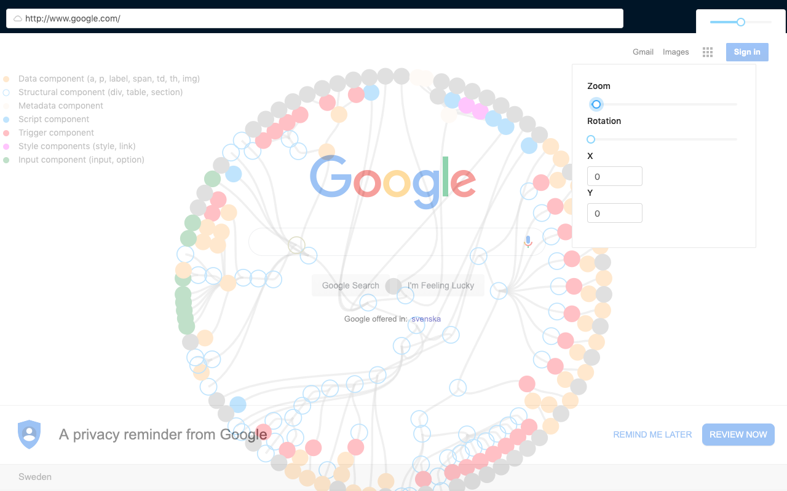

# Mini browser through the looking glass [](https://travis-ci.org/Jacarte/L3-37-Browser)

L3-37 is a mini web browser that superimposes a view of the structure of the web page on top of the actual page. Our goal is to reveal and embody the organization and dynamics of software that runs the world wide web. Citizens interact with browsers worldwide, every day and we which to offer a looking through the glass of web content.

This browser is developed as a tribute to the [Web stalker](http://bak.spc.org/iod/nettime.html), 



Input the url and press enter

## Run dev

```
npm run start
npm run electron-dev
```

## Developing tips


### Access electron from host

```
const electron = window.require('electron');
const fs = electron.remote.require('fs');
const ipcRenderer  = electron.ipcRenderer;
```
### Webview opened issues
